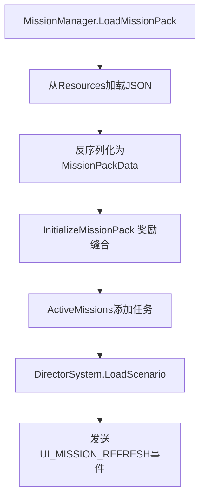

# MissionSystem & MissionGraphWindow 技术分析报告

## 概述

MineRTS的任务系统是一个复杂的事件驱动架构，支持任务链、目标追踪、奖励发放以及剧本事件触发。系统核心包括任务管理器、导演系统、可视化编辑器（MissionGraphWindow）和UI组件，全面集成到游戏的ECS架构中。

## 系统架构

### 1. 核心组件

| 组件 | 路径 | 职责 |
|------|------|------|
| **MissionManager** | `Assets/Scripts/OutStage/Mission/MissionManager.cs` | 任务生命周期管理、进度追踪、奖励发放 |
| **MissionData** | `Assets/Scripts/OutStage/Mission/MissionData.cs` | 任务数据模型定义（目标、奖励、优先级） |
| **DirectorSystem** | `Assets/Scripts/InStage/System/DirectorSystem.cs` | 剧本事件触发与执行（时间/任务完成触发） |
| **MissionGraphWindow** | `Assets/Editor/MissionGraphWindow.cs` | 可视化任务编辑器（Unity Editor工具） |
| **UIMissionTracker** | `Assets/Scripts/OutStage/Mission/MissionUI/MissionTracker.cs` | 任务列表UI控制器 |
| **UIMissionItem** | `Assets/Scripts/OutStage/Mission/MissionUI/UIMissionItem.cs` | 单个任务UI项 |

### 2. 数据模型

```csharp
// 核心数据结构关系
MissionPackData
├── Missions: List<MissionData>
│   ├── Goals: List<MissionGoal> (BuildEntity, KillEntity, SurviveTime等)
│   ├── Reward: MissionReward (金钱、科技点、蓝图)
│   └── NextMissionID: string (任务链)
├── Rewards: List<RewardSaveData> (独立奖励节点)
├── ScenarioEvents: List<ScenarioEventData> (导演节点)
├── SpawnActions: List<SpawnActionData> (召唤节点)
└── AIBrainActions: List<AIBrainActionData> (AI控制节点)
```

## 任务生命周期

### 1. 加载阶段


### 2. 进度追踪
任务进度通过PostSystem事件驱动更新：

| 事件 | 发送源 | 监听器 | 处理逻辑 |
|------|--------|--------|----------|
| `"建筑完成"` | BuildSystem | MissionManager | 更新BuildEntity目标 |
| `"击败目标"` | AttackSystem | MissionManager | 更新KillEntity目标 |
| `"出售资源"` | IndustrialSystem | MissionManager | 更新SellResource目标 |
| `"金币更变"` | IndustrialSystem | MissionManager | 更新EarnMoney目标 |
| `"生存时间增加"` | TimeSystem | MissionManager | 更新SurviveTime目标 |

### 3. 任务完成流程
```csharp
MissionManager.CompleteMission(mission)
├── 标记任务为已完成
├── 发放奖励（通过EVT_MISSION_REWARD事件）
├── 激活连环任务（NextMissionID）
├── 发送UI_MISSION_COMPLETE事件
└── 检查关卡胜利条件（所有主线任务完成）
```

## MissionGraphWindow 可视化编辑器

### 1. 编辑器入口
- **菜单路径**: `Tools/猫娘助手/剧本编辑器 (Graph Mode)`
- **技术栈**: Unity Editor + GraphView API
- **序列化格式**: JSON (支持保存/加载)

### 2. 节点类型

| 节点类型 | 类名 | 功能 | 样式颜色 |
|----------|------|------|----------|
| **任务节点** | `MissionNode` | 定义任务目标、奖励、优先级 | 深蓝(0.2,0.3,0.4) |
| **奖励节点** | `RewardNode` | 独立奖励定义（金钱、科技点、蓝图） | 深绿(0.1,0.4,0.1) |
| **导演节点** | `DirectorNode` | 事件触发器（时间/任务完成触发） | 紫色(0.4,0.1,0.4) |
| **召唤节点** | `SpawnNode` | 单位召唤配置（兵种、数量、位置） | 深红(0.6,0.2,0.2) |
| **AI挂载节点** | `AIBrainNode` | AI波次控制（目标坐标、标识符） | 青蓝(0.2,0.5,0.6) |

### 3. 连接规则
```
任务节点:
  - 输出端口 → 下一任务节点 (逻辑链)
  - 奖励端口 → 奖励节点 (奖励连接)

导演节点:
  - 输入端口 ← 任务节点 (触发条件)
  - 输出端口 → 召唤节点 (触发行为)

召唤节点:
  - 输出端口 → AI挂载节点 (AI控制)
```

### 4. 序列化机制
```csharp
// 序列化过程
MissionGraphView.SerializeToPack()
├── 保存所有奖励节点（位置+数据）
├── 保存所有任务节点（包括连线关系）
├── 保存导演节点及其连线
├── 保存召唤节点和AI节点
└── 返回完整的MissionPackData

// 反序列化过程
MissionGraphView.PopulateFromPack(pack)
├── 重新创建所有节点
├── 重建节点间连线
└── 恢复编辑器状态
```

## 导演系统 (DirectorSystem)

### 1. 事件触发类型
```csharp
public enum TriggerType
{
    Time,              // 时间触发 (TriggerParam = "秒数")
    MissionCompleted,  // 任务完成触发 (TriggerParam = "MissionID")
    AreaReached        // 区域到达触发 (未完全实现)
}
```

### 2. 执行流程
```
DirectorSystem.ExecuteAction(evt)
├── 查找关联的SpawnActionData
├── 批量召唤单位 (EntitySystem.SpawnArmy)
├── 收集生成的EntityHandle
└── 挂载AI控制 (AIBrainServer.ApplyWaveAI)
```

### 3. 时间触发机制
- 在Update()中监测TimeSystem.TotalElapsedSeconds
- 支持浮点数时间参数（如"120.5"表示120.5秒后触发）
- 自动标记已触发事件防止重复执行

## UI系统集成

### 1. 任务追踪UI
```csharp
UIMissionTracker工作流程:
  1. 监听UI_MISSION_REFRESH事件
  2. 从MissionManager.ActiveMissions获取数据
  3. 只显示已激活且未完成的任务
  4. 使用对象池复用UI项
  5. 调用UIMissionItem.Setup()更新显示
```

### 2. 目标进度显示
```csharp
UIMissionItem.GetGoalTypeChinese()转换:
  - BuildEntity → "建造"
  - KillEntity → "击败"
  - SellResource → "出售"
  - SurviveTime → "生存时间"
  - EarnMoney → "赚取金币"

显示格式: ● 建造[钻头]: 2/5
完成状态: ✔ 建造[钻头]: 5/5 (绿色标记)
```

## 事件系统集成

### PostSystem 事件总览
| 事件名 | 发送者 | 参数类型 | 用途 |
|--------|--------|----------|------|
| `"UI_MISSION_REFRESH"` | MissionManager | null | 通知UI刷新任务列表 |
| `"UI_MISSION_COMPLETE"` | MissionManager | MissionData | 任务完成通知 |
| `"EVT_MISSION_REWARD"` | MissionManager | MissionReward | 奖励发放 |
| `"UI_LEVEL_VICTORY"` | MissionManager | null | 关卡胜利通知 |
| `"生存时间增加"` | TimeSystem | MissionArgs | 时间进度更新 |

## 性能优化特性

### 1. 对象池模式
- `MissionArgs` 使用静态对象池（64容量）
- 减少事件传递时的GC分配

### 2. 高效事件处理
- MissionManager使用批量进度更新
- 只在进度实际变化时发送UI刷新事件
- 使用字典快速查找任务链关系

### 3. 编辑器优化
- 可视化连线自动管理
- JSON序列化只保存必要数据
- 支持大型任务图的加载/保存

## 扩展性与维护性

### 1. 易于添加新目标类型
```csharp
// 1. 在GoalType枚举中添加新类型
// 2. 在MissionManager中添加对应的事件监听
// 3. 在UIMissionItem.GetGoalTypeChinese()中添加显示名称
// 4. 在MissionGraphWindow中更新目标类型下拉菜单
```

### 2. 模块化设计
- 任务逻辑与UI显示分离
- 编辑器工具独立于运行时逻辑
- 导演系统可独立扩展新触发器类型

### 3. 调试支持
- 详细的日志输出（带颜色标记）
- `ForceCompleteActiveMissions()`调试方法
- 可视化编辑器实时预览任务关系

## 已知限制与未来改进

### 当前限制
1. **ReachPosition目标类型**：标记为"未实现"，需要位置追踪系统
2. **AreaReached触发器**：已定义但未在DirectorSystem中实现
3. **多任务包管理**：当前支持多包加载但UI可能需增强
4. **任务失败机制**：有IsFailed字段但未实现失败逻辑

### 建议改进
1. **任务条件编辑器**：当前目标配置较基础，可增强为条件表达式
2. **实时预览**：在编辑器中模拟任务进度
3. **版本迁移工具**：任务数据结构变更时的兼容性处理
4. **本地化支持**：任务标题/描述的多语言支持

## 总结

MineRTS的任务系统展示了高度模块化的游戏架构设计：
- **可视化编辑**：通过MissionGraphWindow实现复杂的任务链设计
- **事件驱动**：全面集成PostSystem实现松耦合的组件通信
- **数据驱动**：JSON序列化支持策划独立配置任务内容
- **性能优化**：对象池、批量处理等减少运行时开销
- **扩展性强**：易于添加新目标类型、触发器类型和奖励类型

该系统为RTS游戏提供了完整的任务/剧情框架，支持从简单教程到复杂战役的各种场景设计。