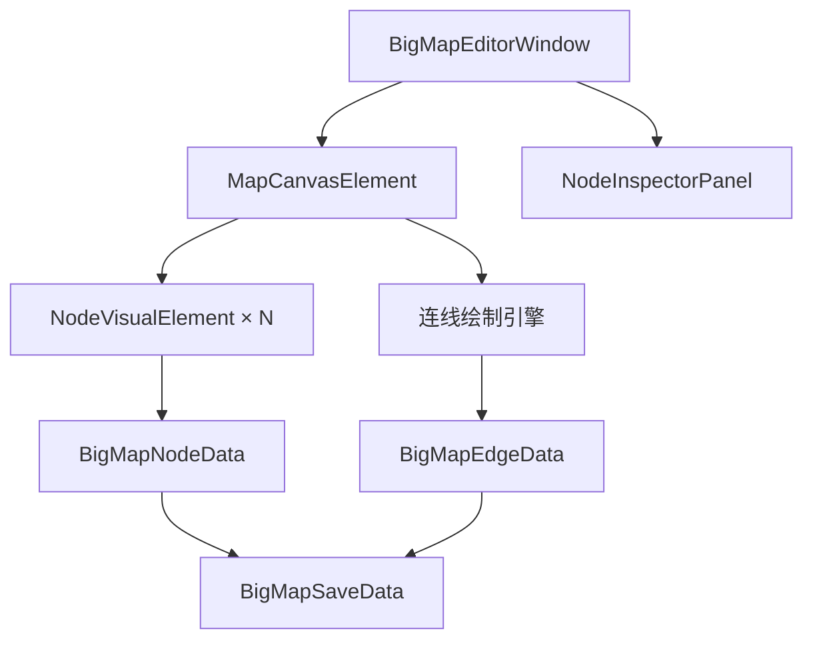
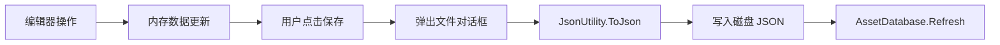

# 大地图拓扑编辑器技术报告

## 概述

**大地图拓扑编辑器**是 MineRTS 游戏开发工具链中的关键组成部分，用于可视化编辑游戏关卡之间的空间拓扑关系。该编辑器**完全基于 Unity UI Toolkit 手搓实现**，严格避免使用 `UnityEditor.Experimental.GraphView`，以提供更高的自定义性和性能优化空间。

编辑器核心功能包括：
- **无限大虚拟画布**：支持平移、缩放导航
- **节点-连线拓扑编辑**：圆形节点表示关卡，直线连线表示通行关系
- **实时属性编辑**：侧边栏 Inspector 双向绑定节点数据
- **JSON 序列化**：完整的保存/加载功能，数据持久化至 `Assets/Resources/BigMapData.json`
- **优化交互手感**：点选式连线、拖拽死区、右键上下文菜单

## 架构设计

### 整体架构



### 1. 数据层 (Data Models)

#### `BigMapSaveData` (`Assets/Scripts/OutStage/BigMap/BigMapSaveData.cs`)
- **根数据结构**：包含节点列表、连线列表、画布偏移和缩放比例
- **序列化支持**：`[Serializable]` 标记，`JsonUtility` 兼容
- **字段说明**：
  ```csharp
  public List<BigMapNodeData> Nodes      // 所有节点数据
  public List<BigMapEdgeData> Edges      // 所有连线数据
  public Vector2 CanvasOffset            // 画布平移偏移
  public float CanvasZoom = 1.0f         // 画布缩放比例
  ```

#### `BigMapNodeData`
- **节点基本属性**：GUID、显示名称、位置坐标
- **扩展字段**：节点类型、附加数据（支持自定义扩展）
- **自动生成**：构造函数自动生成唯一 GUID

#### `BigMapEdgeData`
- **连线关系**：起点节点ID、终点节点ID
- **方向枚举**：`EdgeDirection.Unidirectional`（单向）、`EdgeDirection.Bidirectional`（双向）
- **去重校验**：创建时自动检查重复连线

### 2. 窗口与布局层

#### `BigMapEditorWindow` (`Assets/Editor/BigMapEditorWindow.cs`)
- **窗口入口**：`Tools/猫娘助手/大地图拓扑编辑器`
- **布局结构**：
  ```
  ┌─────────────────────────────────────────────┐
  │ 工具栏 [保存] [加载] [新建节点] [清空画布]  │
  ├───────────────┬─────────────────────────────┤
  │  画布区域     │      属性面板               │
  │  (70%)        │      (30%)                  │
  │               │                             │
  │  ● 节点       │  ┌─────────────────────┐    │
  │    ╱  ╲       │  │ 节点属性编辑        │    │
  │   ╱    ●      │  │ - 显示名称          │    │
  │  ●─────●      │  │ - 位置坐标          │    │
  │               │  │ - 节点类型          │    │
  │               │  │ - 连线管理          │    │
  │               │  └─────────────────────┘    │
  └───────────────┴─────────────────────────────┘
  ```

### 3. 核心画布层

#### `MapCanvasElement` (`Assets/Editor/MapCanvasElement.cs`)
**核心职责**：
- **变换控制**：维护 `_contentContainer` 的平移 (`_canvasOffset`) 和缩放 (`_canvasZoom`)
- **事件处理**：中键/右键拖拽平移、滚轮缩放
- **连线绘制**：重写 `generateVisualContent`，使用 `Painter2D` 绘制直线和箭头
- **背景网格**：动态绘制 100px 网格和 X/Y 坐标轴

**关键算法**：
```csharp
// 坐标转换：屏幕坐标 ↔ 画布坐标
Vector2 ScreenToCanvasPosition(Vector2 screenPosition) {
    Vector2 localPosition = screenPosition - canvasRect.position;
    return (localPosition - _canvasOffset) / _canvasZoom;
}

Vector2 CanvasToScreenPosition(Vector2 canvasPosition) {
    return canvasPosition * _canvasZoom + _canvasOffset;
}
```

### 4. 节点元素层

#### `NodeVisualElement` (`Assets/Editor/NodeVisualElement.cs`)
**视觉表现**：
- **尺寸**：正常 12×12px，选中 16×16px
- **形状**：圆形（通过四个边框圆角实现）
- **颜色**：正常蓝色、选中黄色、拖拽中橙色

**交互优化**：
- **拖拽死区**：5 像素阈值，避免误操作
- **状态机**：`PointerDown → PointerMove（距离检测）→ PointerUp（判定点击/拖拽）`
- **事件分离**：左键用于选择/拖拽，右键用于连线创建

### 5. 属性面板层

#### `NodeInspectorPanel` (`Assets/Editor/NodeInspectorPanel.cs`)
**动态UI生成**：
- **数据绑定**：`RegisterValueChangedCallback` 实时双向同步
- **字段编辑**：显示名称、位置坐标、节点类型、附加数据
- **连线管理**：显示与该节点相关的所有连线，支持删除
- **节点操作**：一键删除节点（含确认对话框）

## 核心功能详解

### 1. 画布导航系统

| 操作 | 触发方式 | 实现原理 |
|------|----------|----------|
| **平移** | 中键/右键拖拽 | 修改 `_canvasOffset`，更新 `transform.position` |
| **缩放** | 鼠标滚轮 | 修改 `_canvasZoom`（0.1~5.0范围），以鼠标位置为中心 |
| **重置视图** | 工具栏"清空画布" | 重置数据模型，重建画布 |

**缩放中心保持算法**：
```csharp
Vector2 mouseCanvasPosBefore = ScreenToCanvasPosition(mousePosition);
CanvasZoom *= (1 + zoomDelta);
Vector2 mouseCanvasPosAfter = ScreenToCanvasPosition(mousePosition);
_canvasOffset += (mouseCanvasPosAfter - mouseCanvasPosBefore) * _canvasZoom;
```

### 2. 节点-连线编辑工作流

#### 优化后的连线创建（点选指令式）
```
传统方式：按住 Shift 拖拽（难触发、反直觉）
优化方案：左键点选 + 右键连接

步骤：
1. 左键单击 Node A → 选中（高亮显示）
2. 保持选中状态
3. 右键单击 Node B → 自动创建连线（双向）
```

#### 节点操作
- **创建**：右键点击画布空白处（或工具栏按钮）
- **移动**：左键拖拽节点（5像素死区避免误触）
- **选择**：左键单击（属性面板同步更新）
- **删除**：选中后按 Delete 键 或 属性面板删除按钮

### 3. 数据持久化

**序列化流程**：


**文件格式示例**：
```json
{
  "Nodes": [
    {
      "StageID": "a1b2c3d4-e5f6-7890-abcd-ef1234567890",
      "DisplayName": "起始关卡",
      "Position": { "x": 100.0, "y": 50.0 },
      "NodeType": "Start",
      "ExtraData": ""
    }
  ],
  "Edges": [
    {
      "FromNodeID": "a1b2c3d4-e5f6-7890-abcd-ef1234567890",
      "ToNodeID": "b2c3d4e5-f6a7-8901-bcde-f23456789012",
      "Direction": 1,
      "ExtraData": ""
    }
  ],
  "CanvasOffset": { "x": -120.5, "y": 80.3 },
  "CanvasZoom": 1.5
}
```

### 4. 视觉参考系

**背景网格系统**：
- **网格间隔**：100 逻辑像素（受缩放影响）
- **坐标轴**：X轴（暗红色，Y=0）、Y轴（暗绿色，X=0）
- **动态范围**：根据视口计算需要绘制的网格线数量
- **性能优化**：只绘制可见范围内的网格线

**实现代码**：
```csharp
private void DrawGridAndAxes(Painter2D painter) {
    // 计算当前视口的逻辑坐标范围
    Vector2 canvasMin = ScreenToCanvasPosition(Vector2.zero);
    Vector2 canvasMax = ScreenToCanvasPosition(canvasSize);

    // 绘制网格线（间隔100px）
    for (float x = startX; x <= endX; x += 100.0f) {
        Vector2 screenStart = CanvasToScreenPosition(new Vector2(x, canvasMin.y));
        Vector2 screenEnd = CanvasToScreenPosition(new Vector2(x, canvasMax.y));
        // 绘制垂直线...
    }
}
```

## 交互优化专项

### 问题诊断与解决方案

| 问题 | 症状 | 解决方案 |
|------|------|----------|
| **连线创建困难** | Shift+拖拽极难触发，反直觉 | 改为"点选指令式"：左键选A，右键点B |
| **点击/拖拽混淆** | 移动1像素就进入拖拽状态 | 引入5像素死区，精确区分意图 |
| **节点创建误触** | 左键双击常被误触发 | 废弃双击创建，强化右键上下文菜单 |
| **空间感缺失** | 纯黑背景缺乏参考系 | 添加网格和坐标轴，建立空间坐标系 |

### 状态机重构

**NodeVisualElement 事件处理流程**：
```
PointerDown (左键)
    ├── 记录 _pointerDownPosition
    ├── 设置 _isPointerDown = true
    └── 捕获指针

PointerMove
    ├── 如果 _isPointerDown && !_isDragging
    │   ├── 计算与按下点的距离
    │   └── 距离 > 5px → 进入拖拽模式
    └── 如果 _isDragging
        └── 更新节点位置，触发位置变更事件

PointerUp (左键)
    ├── 重置 _isPointerDown = false
    ├── 如果 _isDragging
    │   ├── 结束拖拽，恢复样式
    │   └── 触发拖拽结束事件
    └── 否则
        └── 触发选中事件（纯点击）
```

## 性能考量

### 1. 渲染优化
- **批量绘制**：所有连线在单个 `generateVisualContent` 调用中绘制
- **视口裁剪**：网格线只绘制可见范围内的部分
- **缩放适应**：线宽、箭头尺寸随缩放比例动态调整

### 2. 内存管理
- **数据绑定**：节点可视化元素与数据模型松耦合
- **事件清理**：`OnDisable` 中解除所有事件订阅
- **资源释放**：删除节点时清理相关连线数据

### 3. 响应式设计
- **实时重绘**：节点移动、连线变化即时触发 `MarkDirtyRepaint()`
- **增量更新**：平移缩放时只更新变换矩阵，不重建节点
- **防抖处理**：高频事件（如滚轮缩放）有合理的事件传播控制

## 扩展性设计

### 1. 数据模型扩展
```csharp
// 可通过继承或直接扩展字段添加新功能
public class ExtendedNodeData : BigMapNodeData {
    public string CustomField;
    public List<string> Tags;
    public Color NodeColor;  // 自定义节点颜色
}

public class ExtendedEdgeData : BigMapEdgeData {
    public float Weight;     // 连线权重
    public string Condition; // 通行条件
}
```

### 2. 可视化扩展点
- **节点样式**：重写 `NodeVisualElement` 的样式设置方法
- **连线渲染**：扩展 `DrawArrow` 方法支持不同箭头样式
- **背景图层**：在 `DrawGridAndAxes` 前后添加自定义绘制逻辑

### 3. 交互扩展
- **快捷键**：在 `BigMapEditorWindow.HandleKeyboardShortcuts` 中添加新快捷键
- **上下文菜单**：扩展 `OnContextClick` 提供更多操作选项
- **拖拽行为**：修改拖拽死区阈值或添加特殊拖拽模式

## 使用指南

### 快速开始
1. **打开编辑器**：`Tools/猫娘助手/大地图拓扑编辑器`
2. **创建节点**：右键点击画布空白处
3. **移动节点**：左键拖拽节点（有5像素缓冲）
4. **创建连线**：左键选节点A → 右键点节点B
5. **编辑属性**：点击节点，在右侧面板修改
6. **保存/加载**：使用工具栏按钮

### 最佳实践
1. **布局规划**：先放置主要节点，再添加连线
2. **命名规范**：为节点设置有意义的显示名称
3. **版本控制**：定期保存不同版本的设计方案
4. **备份策略**：重要拓扑图导出为JSON备份

### 故障排除
| 问题 | 可能原因 | 解决方案 |
|------|----------|----------|
| 节点无法拖拽 | 死区设置过大/过小 | 检查 `NodeVisualElement` 中的5像素阈值 |
| 连线不显示 | 节点ID不匹配 | 检查连线数据的 FromNodeID/ToNodeID |
| 画布卡顿 | 节点数量过多 | 优化 `OnGenerateVisualContent` 绘制逻辑 |
| 保存失败 | 文件路径权限 | 确保保存到 Assets 目录下 |

## 未来规划

### 短期增强
1. **多选操作**：Shift+框选多个节点，批量编辑
2. **连线样式**：支持虚线、点线等不同连线样式
3. **导入/导出**：支持与其他工具的数据交换格式

### 长期愿景
1. **集成游戏数据**：直接绑定游戏中的关卡数据
2. **路径分析**：基于拓扑关系的路径查找算法
3. **协作编辑**：多人实时编辑支持

---

**技术栈**：Unity 2022.3.57f1c2 · UI Toolkit · C# · JSON
**维护者**：猫娘助手开发团队
**版本**：1.0.0 (2026-02-28)
**文档状态**：技术实现报告