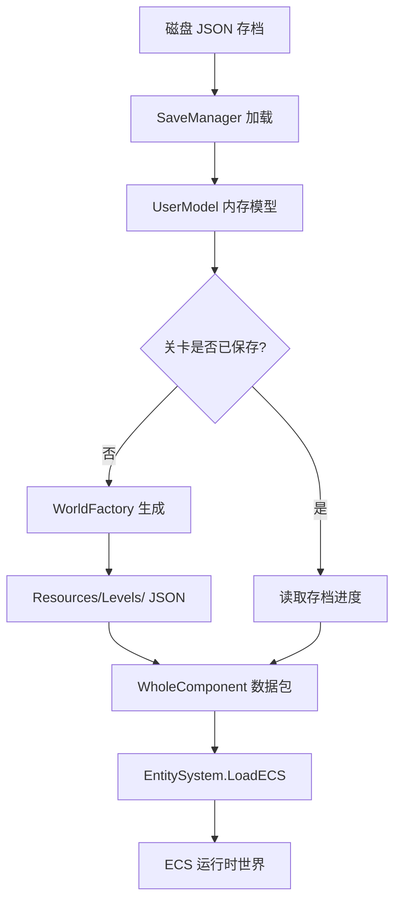

# 游戏加载流程详解

## 概述

MineRTS 采用**存档驱动**的关卡加载机制，实现了从磁盘持久化数据到内存运行时状态的完整管线。整个流程围绕 **ECS (Entity-Component-System)** 架构设计，支持关卡进度保存与恢复、初次进入生成、以及大地图与战斗场景的无缝切换。

## 核心数据流



## 关键类与职责

### 1. SaveManager (`Assets/Scripts/OutStage/SaveManager.cs`)
- **职责**: 存档文件的磁盘 I/O、内存状态管理
- **核心方法**:
  - `LoadSave(string saveName)`: 从 `Application.persistentDataPath/Saves/` 读取 JSON 文件，反序列化为 `UserModel`
  - `SaveGameToDisk()`: 将当前 `UserModel` 序列化后写入磁盘
  - `SaveCurrentStageFromSystem()`: 从 `EntitySystem` 提取当前关卡热数据，更新到 `UserModel`
  - `ExitCurrentStage()`: 撤离当前关卡，清理 ECS 世界

### 2. UserModel (`Assets/Scripts/OutStage/UserModel.cs`)
- **职责**: 内存中的用户进度数据容器
- **数据结构**:
  - `Metadata`: 存档元数据（玩家名、保存时间等）
  - `Progression`: 全局进度（金钱、科技点等）
  - `StageList`: 关卡保存数据列表（序列化用）
  - `_stageDict`: 关卡 ID 到 `StageSaveData` 的字典（运行时缓存）
- **关键操作**:
  - `RebuildRuntimeCache()`: 反序列化后重建字典索引
  - `GetStage(string id)`: 获取指定关卡的保存数据
  - `UpdateStage()`: 更新或创建关卡进度记录

### 3. GameFlowManager (`Assets/Scripts/OutStage/GameFlowManager.cs`)
- **职责**: 游戏状态机，控制大地图与关卡的切换
- **状态枚举**: `GameState.BigMap` / `GameState.InStage`
- **核心流程**:
  1. `RequestEnterStage(string stageID)`:
     - 调用 `UserModelManager.Instance.LoadStageIntoSystem(stageID)` (注：实际应调用 `SaveManager` 相关方法)
     - 切换 UI 面板，重置摄像机位置
  2. `RequestReturnToMap()`:
     - 保存当前战况到 `UserModel`
     - 持久化到磁盘（防崩溃）
     - 清理 `EntitySystem` 世界
     - 切换回大地图 UI

### 4. EntitySystem (`Assets/Scripts/InStage/System/EntitySystem.cs`)
- **职责**: ECS 总管，关卡数据的加载与运行时管理
- **核心加载方法**:
  - `LoadStage(string stageID)`:
    ```csharp
    // 1. 获取当前用户存档
    var user = SaveManager.Instance.CurrentUser;
    // 2. 尝试从存档获取已保存的关卡数据
    var stageRecord = user.GetStage(stageID);
    if (stageRecord != null && stageRecord.WorldData != null) {
        worldData = stageRecord.WorldData;  // 恢复现场
    } else {
        // 3. 存档里没有，从静态 JSON 生成新世界
        worldData = WorldFactory.CreateNewWorldFromLevelID(stageID);
    }
    // 4. 注入数据到 ECS
    LoadECS(worldData);
    // 5. 更新 SaveManager 的当前关卡指针
    SaveManager.Instance.CurrentActiveStageID = stageID;
    ```
  - `LoadECS(WholeComponent loadedData)`:
    - 深拷贝数据，避免污染存档源
    - 重建 ID 映射表 (`RebuildRuntimeIndices`)
    - 重建网格占据信息 (`RebuildGridOccupancy`)
    - 执行全图 NavMesh 矩形剖分
    - 激活系统，同步视觉层

### 5. WorldFactory (`Assets/Scripts/OutStage/LevelMap/WorldFactory.cs`)
- **职责**: 从静态 JSON 资源创建初始关卡世界
- **数据源**: `Resources/Levels/{levelID}.json`
- **创建流程**:
  1. 使用 `Resources.Load<TextAsset>` 加载 JSON 文件
  2. 反序列化为 `LevelMapData` 结构
  3. 构建 `WholeComponent` 并填充：
     - 地图尺寸 (`mapWidth`, `mapHeight`)
     - 原点坐标 (`minX`, `minY`)
     - 地面/网格/特效图层数据
     - 预分配组件数组（容量 1024）
- **输出**: 一个完整的、可注入 ECS 的 `WholeComponent` 数据包

### 6. WholeComponent (`Assets/Scripts/InStage/System/EntitySystem.cs:837`)
- **职责**: 所有实体组件数据的容器（相当于 ECS 的“世界快照”）
- **包含**:
  - 实体计数与地图信息
  - 所有组件类型的数组 (`CoreComponent[]`, `MoveComponent[]`, ...)
  - 三种地图图层数组 (`groundMap`, `gridMap`, `effectMap`)
- **重要特性**: 实现了 `Clone()` 方法，支持深拷贝，确保存档数据独立性

## 详细加载时序

### 首次进入新关卡
1. **玩家点击据点** → `StageNodeView` 调用 `GameFlowManager.RequestEnterStage("stage_01")`
2. **检查存档** → `SaveManager.CurrentUser.GetStage("stage_01")` 返回 `null`
3. **静态生成** → `WorldFactory.CreateNewWorldFromLevelID("stage_01")`
   - 读取 `Resources/Levels/stage_01.json`
   - 构建初始 `WholeComponent`（仅地图，无动态实体）
4. **ECS 注入** → `EntitySystem.LoadECS(worldData)`
   - 清理旧世界，深拷贝新数据
   - 重建 ID 映射和网格占据
   - 激活系统，同步 Tilemap
5. **状态更新** → `SaveManager.CurrentActiveStageID = "stage_01"`
6. **UI 切换** → 隐藏大地图面板，显示战斗 HUD，摄像机归位

### 加载已保存的关卡
1. **相同起点** → `GameFlowManager.RequestEnterStage("stage_01")`
2. **存档命中** → `user.GetStage("stage_01")` 返回 `StageSaveData`
3. **数据恢复** → 直接使用 `stageRecord.WorldData`（包含上次保存的所有实体状态）
4. **ECS 注入** → 同首次进入，但恢复的是完整战场快照
5. **指针更新** → 记录当前活跃关卡 ID

### 撤离关卡返回大地图
1. **玩家点击撤退** → `GameFlowManager.RequestReturnToMap()`
2. **热数据保存** → `SaveManager.Instance.SaveCurrentStageFromSystem()`
   - 从 `EntitySystem.wholeComponent` 提取快照（Clone）
   - 调用 `user.UpdateStage(stageID, snapshot, false)`
3. **磁盘持久化** → `SaveManager.Instance.SaveGameToDisk()`（可选）
4. **世界清理** → `EntitySystem.Instance.ClearWorld()`
   - 回收所有 Entity ID，版本号递增
   - 清空 GridSystem 占据
   - 重置各子系统缓存
5. **状态切换** → `CurrentState = GameState.BigMap`，切换 UI 面板

## 数据持久化细节

### 存档文件位置
```
Application.persistentDataPath/Saves/
├── AutoSave.json
├── Slot_1.json
└── ...
```

### JSON 结构示例
```json
{
  "Metadata": {
    "PlayerName": "指挥官-AutoSave",
    "SaveDate": "2026-02-27",
    "TotalPlayTime": 3600.5,
    "LevelReached": 3
  },
  "Progression": {
    "GlobalMoney": 15000,
    "TechPoint": 5,
    "UnlockedBlueprints": ["miner", "conveyor"]
  },
  "StageList": [
    {
      "StageID": "stage_01",
      "WorldData": { ... },  // WholeComponent 的序列化数据
      "IsCleared": false
    }
  ]
}
```

### 静态关卡资源
```
Assets/Resources/Levels/
├── stage_01.json
├── stage_02.json
└── ...
```

## 关键设计决策

### 1. 双数据源策略
- **优先读取存档热数据**：提供进度延续体验
- **回退到静态 JSON**：支持初次进入和关卡重置
- **分离关注点**：`WorldFactory` 只负责初始生成，不参与运行时修改

### 2. 深拷贝保护
- `WholeComponent.Clone()` 确保存档数据独立性
- `LoadECS()` 内部进行深拷贝，避免运行时修改污染存档源
- 实体句柄包含版本号，防止旧 ID 误操作

### 3. 状态机清晰划分
- `GameState.BigMap`：仅有 UI 和存档数据，无 ECS 实体
- `GameState.InStage`：完整的 ECS 世界运行中
- 通过 `CurrentActiveStageID` 指针明确当前所处关卡

### 4. 懒加载与缓存
- `UserModel._stageDict` 字典加速关卡查找
- `Resources.Load` 缓存静态 JSON 资源
- 组件数组预分配避免运行时扩容

## 常见问题与调试

### 1. 实体不显示
- 检查 `EntitySystem.LoadECS()` 后 `_initialized` 是否为 `true`
- 验证 `TilemapSyncManager.Instance.SyncToTilemap()` 是否被调用
- 确认 `DrawSystem` 是否正常更新

### 2. 存档加载失败
- 确认 `SaveManager.CurrentUser` 不为 `null`
- 检查 JSON 文件路径和格式是否正确
- 查看 `RebuildRuntimeCache()` 是否成功重建字典

### 3. 网格占据异常
- `RebuildGridOccupancy()` 是否基于 `LogicSize` 正确恢复占据
- 检查 `GridSystem.Instance.SetOccupantRect` 参数是否正确
- 确认地图尺寸与原点坐标匹配

### 4. 性能优化建议
- 大型关卡可考虑分区域加载
- 存档时可选压缩序列化数据
- 频繁保存时可使用增量更新策略

## 扩展点

### 1. 自定义关卡生成
继承 `WorldFactory` 并重写 `CreateNewWorldFromLevelID`，支持程序化生成地形。

### 2. 存档版本迁移
在 `UserModel` 中添加版本字段，在 `RebuildRuntimeCache` 中实现数据迁移逻辑。

### 3. 云端存档同步
扩展 `SaveManager`，在 `SaveGameToDisk` 和 `LoadSave` 中集成云存储 API 调用。

### 4. 关卡流式加载
修改 `LoadECS` 支持分块加载，配合 `UnityEngine.AddressableAssets` 实现资源异步加载。

---

## 备注与已知问题

### 1. UserModelManager 引用不一致
当前代码中存在对 `UserModelManager` 的引用（`GameFlowManager.cs:29`, `StageNodeView.cs:29`），但项目中未找到该类的实现。实际功能可能由 `SaveManager` 提供，建议统一引用以避免运行时错误。

### 2. 关卡通关状态存储
`StageNodeView` 中使用了 `user.StageClearStatus` 字典，但 `UserModel` 中未定义该字段。实际通关状态应通过 `StageSaveData.IsCleared` 字段判断。

### 3. 加载入口统一
`GameFlowManager.RequestEnterStage` 直接调用 `UserModelManager`，而 `EntitySystem.LoadStage` 是实际的加载入口。建议将两者逻辑整合，确保单一入口。

---

*文档最后更新: 2026-02-27*
*对应代码版本: MineRTS ECS 架构 v2.5*