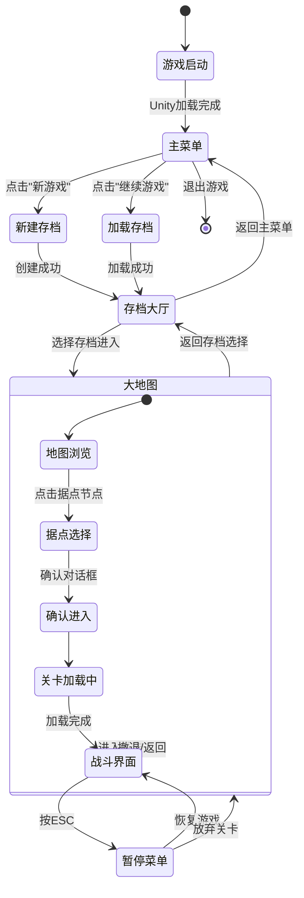

# 游戏状态流转全图

## 概述
MineRTS 采用**单场景多状态**架构，所有游戏流程均在 `Assets/Scenes/SampleScene.unity` 中通过 UI 切换完成。本文档描绘从游戏启动到关卡内战斗的完整状态流转。

## 核心状态机



## 详细状态说明

### 1. 游戏启动 (Game Startup)
- **触发**: Unity 引擎初始化完成，加载 `SampleScene.unity`
- **关键系统初始化**:
  - `SingletonMono<T>` 单例系统自启动
  - UI 画布与事件系统就绪
  - 资源管理器预热
- **流转**: 自动进入主菜单状态

### 2. 主菜单 (Main Menu)
- **UI 表现**: 标题、开始游戏、继续游戏、设置、退出按钮
- **用户操作**:
  - **新游戏**: 进入新建存档流程
  - **继续游戏**: 进入存档选择界面
  - **设置**: 弹出设置面板（子状态）
  - **退出**: 关闭游戏
- **数据状态**: 无存档加载，仅基础系统运行

### 3. 新建存档 (Create New Save)
- **触发**: 主菜单点击"新游戏"
- **核心流程**:
  ```csharp
  // SaveManager.CreateNewSave(string saveName)
  1. 强制清理当前运行时状态 (UnloadCurrentWorld)
  2. 创建全新 UserModel 对象
  3. 设置玩家元数据 (Metadata)
  4. 初始化全局进度 (Progression)
  5. 立即持久化到磁盘
  6. 切换至存档大厅状态
  ```
- **数据产出**: 全新的 `.json` 存档文件

### 4. 加载存档 (Load Save)
- **触发**: 主菜单点击"继续游戏" 或 存档大厅选择存档
- **核心流程**:
  ```csharp
  // SaveManager.LoadSave(string saveName)
  1. 清理当前运行时状态 (UnloadCurrentWorld)
  2. 从磁盘读取 JSON 文件
  3. 反序列化为 UserModel
  4. 重建运行时缓存 (RebuildRuntimeCache)
  5. 设置当前活动存档引用
  6. 切换至存档大厅状态
  ```
- **数据恢复**: 完整的玩家进度和关卡记录

### 5. 存档大厅 (Save Lobby)
- **UI 表现**: 存档槽位列表、删除存档、返回主菜单
- **功能**:
  - 显示所有可用存档 (`GetAllSaveFiles()`)
  - 支持存档删除 (`DeleteSave()`)
  - 提供"进入游戏"入口
- **数据状态**: `SaveManager.CurrentUser` 已就绪，但 ECS 世界未加载

### 6. 大地图 (BigMap)
- **GameFlowManager 状态**: `GameState.BigMap`
- **UI 表现**:
  - `BigMapPanel` 显示（大地图 UI 根节点）
  - 关卡节点网格 (`StageNodeView` 集合)
  - 全局资源统计显示
- **数据状态**:
  - ECS 世界已清理 (`EntitySystem.ClearWorld()`)
  - 无运行时实体，仅 UI 交互
- **用户操作**:
  1. **浏览地图**: 拖动/缩放查看关卡布局
  2. **选择据点**: 点击 `StageNodeView` 节点
  3. **进入关卡**: 确认后触发 `RequestEnterStage()`
  4. **返回存档大厅**: 退出当前存档会话

### 7. 关卡进入流程 (Stage Entry Flow)
```
用户点击据点 → StageNodeView.OnNodeClicked()
                 ↓
       GameFlowManager.RequestEnterStage(stageID)
                 ↓
   UserModelManager.Instance.LoadStageIntoSystem(stageID)
                 ↓
           EntitySystem.LoadStage(stageID)
                 ↓
   [分支判断: 存档中有记录?]
         ↓ 有 ↓           ↓ 无 ↓
   读取存档进度        WorldFactory生成新世界
         ↓                   ↓
   WholeComponent数据包    WholeComponent数据包
         ↓                   ↓
     EntitySystem.LoadECS()
                 ↓
       切换至战斗界面状态
```

### 8. 战斗界面 (InStage)
- **GameFlowManager 状态**: `GameState.InStage`
- **UI 表现**:
  - `StageHUDPanel` 显示（战斗界面 UI 根节点）
  - 单位指令面板、资源栏、小地图
  - 建造菜单、科技树
- **数据状态**:
  - ECS 世界完全激活 (`_initialized = true`)
  - 实体数量: `wholeComponent.entityCount`
  - 所有子系统运行中 (MoveSystem, AttackSystem, IndustrialSystem, etc.)
- **子状态**:
  - **正常游戏**: 实时模拟运行
  - **暂停菜单**: ESC 键触发，时间停止
  - **建造模式**: 建筑放置界面
  - **单位选择**: 多单位编队管理

### 9. 关卡撤退流程 (Stage Exit Flow)
```
用户点击撤退 → GameFlowManager.RequestReturnToMap()
                 ↓
   SaveManager.SaveCurrentStageFromSystem()
                 ↓
         [可选] 立即磁盘保存
                 ↓
      EntitySystem.ClearWorld()
                 ↓
      切换至大地图状态
                 ↓
         UI面板切换回大地图
```

### 10. 暂停菜单 (Pause Menu)
- **触发**: 战斗界面中按 ESC 键
- **功能选项**:
  - 恢复游戏
  - 保存并退出到大地图
  - 游戏设置
  - 退出到主菜单
- **系统状态**: 时间系统暂停 (`TimeSystem.SetPaused(true)`)

## 状态数据流转

### 内存数据生命周期
```
主菜单 → 无 UserModel
    ↓
存档大厅 → SaveManager.CurrentUser 就绪
    ↓
大地图 → UserModel 活跃，ECS 空
    ↓
战斗界面 → UserModel + ECS 世界同步
    ↓
保存/撤退 → ECS → UserModel → 磁盘
```

### 关键状态标志
| 状态 | SaveManager.CurrentUser | SaveManager.CurrentActiveStageID | EntitySystem._initialized |
|------|-------------------------|----------------------------------|---------------------------|
| 主菜单 | null | null | false |
| 存档大厅 | ✓ 非空 | null | false |
| 大地图 | ✓ 非空 | null | false |
| 战斗界面 | ✓ 非空 | ✓ 关卡ID | true |

## UI 面板切换矩阵

| 状态 | BigMapPanel | StageHUDPanel | 其他重要面板 |
|------|-------------|---------------|-------------|
| 主菜单 | × | × | MainMenuPanel |
| 存档大厅 | × | × | SaveSelectionPanel |
| 大地图 | ✓ | × | (无) |
| 战斗界面 | × | ✓ | HUD 各子面板 |
| 暂停菜单 | × | ✓ (半透明) | PauseMenuPanel |

## 错误处理与边界情况

### 1. 存档损坏
- **场景**: `LoadSave()` 反序列化失败
- **处理**: catch 异常，提示用户，可选创建新存档恢复

### 2. 关卡资源缺失
- **场景**: `WorldFactory` 找不到 `Resources/Levels/{id}.json`
- **处理**: 日志报错，返回大地图，显示"关卡维护中"

### 3. ECS 加载失败
- **场景**: `LoadECS()` 中数组越界或空引用
- **处理**: 清理现场，返回安全状态（大地图），记录错误日志

### 4. 内存不足
- **场景**: 实体数量超过 `maxEntityCount` (1024)
- **处理**: 停止生成新实体，显示警告，建议优化布局

## 扩展点设计

### 1. 新增游戏模式
在存档大厅后插入新模式选择状态（战役/沙盒/多人）

### 2. 场景切换支持
如需真场景切换，可修改 `GameFlowManager` 中的 `LoadScene` 注释为实际实现

### 3. 云存档集成
在存档保存/加载时添加云端同步层

### 4. 新手引导
在主菜单后插入引导流程状态，逐步教学

## 调试与监控

### 关键日志标记
```csharp
// 状态切换日志
Debug.Log($"<color=orange>[Flow]</color> 正在前往据点 {stageID}...");
Debug.Log($"<color=orange>[Flow]</color> 正在撤离据点...");

// 存档操作日志
Debug.Log($"<color=cyan>[SaveManager]</color> 正在创建新存档: {saveName}...");
Debug.Log($"<color=yellow>[SaveManager]</color> 正在读取存档: {saveName}...");

// ECS 加载日志
Debug.Log($"<color=yellow>[EntitySystem]</color> 正在请求进入据点: {stageID}...");
Debug.Log($"<color=green>[EntitySystem]</color> 世界加载完成！实体数: {wholeComponent.entityCount}");
```

### 状态验证检查点
1. 进入战斗界面前确保 `SaveManager.CurrentUser != null`
2. 调用 `EntitySystem.LoadStage` 前确保系统已初始化
3. 撤退时先保存再清理，防止数据丢失
4. UI 切换时检查面板引用不为空

---

## 附录：实际代码引用

### 状态枚举定义 (`GameFlowManager.cs:11`)
```csharp
public enum GameState { BigMap, InStage }
public GameState CurrentState = GameState.BigMap;
```

### UI 切换逻辑 (`GameFlowManager.cs:66-70`)
```csharp
private void ToggleUI(bool showMap)
{
    if (BigMapPanel) BigMapPanel.SetActive(showMap);
    if (StageHUDPanel) StageHUDPanel.SetActive(!showMap);
}
```

### 存档生命周期管理 (`SaveManager.cs:218-233`)
```csharp
private void UnloadCurrentWorld()
{
    // 1. 清空 ECS 系统
    if (EntitySystem.Instance != null)
        EntitySystem.Instance.ClearWorld();

    // 2. 重置当前关卡指针
    CurrentActiveStageID = null;

    // 3. 销毁当前的 UserModel 引用
    CurrentUser = null;

    System.GC.Collect();
}
```

---

*文档最后更新: 2026-02-27*
*对应架构: MineRTS 单场景 ECS v2.5*

> 注意：当前代码中存在对 `UserModelManager` 的未实现引用，实际功能由 `SaveManager` 提供，需统一修正。