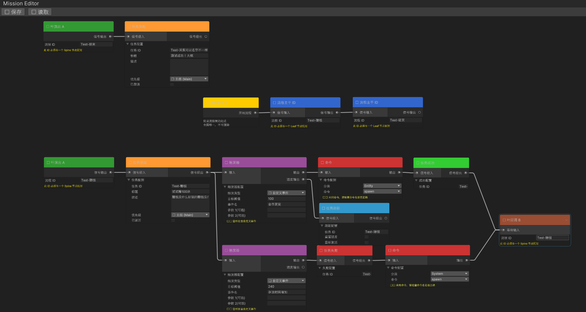

# MineRTS

> 🎯 即时战略 + 工厂模拟游戏 | 个人技术展示项目  
> 🎯 Real-Time Strategy + Factory Simulation Game | Personal Technical Showcase Project

<div align="center">

**Unity ECS 架构实践 · NekoGraph 可视化脚本系统 · 多子系统协同**

**Unity ECS Architecture · NekoGraph Visual Scripting · Multi-System Collaboration**

[Unity 2022.3](https://unity.com/) · [URP](https://unity.com/render-pipelines/universal-render-pipeline) ·
[C#](https://docs.microsoft.com/zh-cn/dotnet/csharp/)

</div>

---

## 📖 目录 / Table of Contents

- [项目简介 / Project Overview](#-项目简介--project-overview)
- [NekoGraph 可视化脚本系统](#-nekograph-可视化脚本系统) ⭐
- [Command 命令管道系统](#-command-命令管道系统)
- [ECS 游戏架构](#-ecs-游戏架构)
- [技术亮点 / Technical Highlights](#-技术亮点--technical-highlights)
- [编译与运行 / Build & Run](#-编译与运行--build--run)
- [项目结构 / Project Structure](#-项目结构--project-structure)
- [许可证 / License](#-许可证--license)

---

## 🎮 项目简介 / Project Overview

**MineRTS**
是一款融合工厂建设物流（类似 Factorio）与传统 RTS 战斗的 2D 即时战略游戏。项目采用**自定义 ECS 架构**与**NekoGraph 可视化脚本系统**，实现高性能游戏逻辑与灵活的任务/剧情编辑能力。

**MineRTS** is a 2D real-time strategy game combining factory-building logistics (similar to Factorio) with traditional
RTS combat. The project features a **custom ECS architecture** and **NekoGraph visual scripting system** for
high-performance game logic and flexible mission/story editing.

### 核心技术特色 / Core Technical Features

| 技术模块                 | 说明                                                 |
| ------------------------ | ---------------------------------------------------- |
| **NekoGraph 可视化脚本** | 自研节点式流程图编辑器，支持任务/剧情/事件可视化编排 |
| **自定义 ECS 架构**      | 非 Unity DOTS，纯 C# 实现的高性能实体组件系统        |
| **Command 命令管道**     | 管道化命令执行框架，支持命令链数据传递               |
| **多子系统协同**         | 20+ 子系统：寻路、电力、传送带、战斗、AI 等          |

### 技术栈 / Technology Stack

| 类别     | 技术                                    |
| -------- | --------------------------------------- |
| 游戏引擎 | Unity 2022.3.57f1c2                     |
| 渲染管线 | Universal Render Pipeline (URP) 14.0.11 |
| 编程语言 | C#                                      |
| 架构模式 | 自定义 ECS + 可视化脚本系统             |
| 代码规模 | 200+ C# 脚本文件                        |
| 目标平台 | Windows                                 |

---

## 🎨 NekoGraph 可视化脚本系统

> ⭐ **项目核心亮点** - 基于“解耦监听器”与“独立比较器”的 2.0 架构喵~ (=^･ω･^=)

<div align="center">



_NekoGraph 编辑器界面与节点流程图（旧版-未加入比较器）_

</div>

### 系统概述 / Overview

NekoGraph 2.0 采用了 **Trigger (监听) + Comparer (判定)**
的彻底解耦模式。逻辑流不再是臃肿的单一节点，而是像积木一样可以自由组合的“协议化信号链”。

**核心设计理念**:

- **Trigger (🔔 监听器)**：只负责“喊一嗓子”。它监听总线，一旦目标事件发生，立即将数据（Payload）打包并向下游发送。
- **Comparer (⚖️ 比较器)**：逻辑安检站。它接收 Trigger 发来的包裹，根据预设逻辑进行判定。
- **Backtrace
  (🔄 失败回溯)**：当比较器判定失败时，信号会自动沿路径回溯并重新激活上游 Trigger，**消灭图面上的冗余回调连线**喵！

### 🛡️ 强类型事件契约 (Strong-Typed Events)

为了解决 Agent 时代的代码契约问题，我们建立了钢铁般的“邮局协议”喵：

- **GameEvent**：集约化枚举定义，每个事件都绑定了 `EventProtocol`（如 Entity, Numeric, String）。
- **PostOffice**：官方唯一发货口，自带运行时协议审计。
- **Static Analyzer**：编辑器自动扫描代码，禁止私自绕过邮局发送契约事件喵！

### 架构总览 / Architecture

```
┌─────────────────────────────────────────────────────────────────┐
│                    GraphRunner (中央调度器)                      │
├─────────────────────────────────────────────────────────────────┤
│  信号流转链条 / Signal Flow Chain:                               │
│                                                                 │
│  [Game Logic] -> PostOffice -> PostSystem                       │
│                                     ↓                           │
│  ┌────────────┐      ┌────────────┐      ┌────────────┐         │
│  │ TriggerNode│─────▶│ComparerNode│─────▶│ CommandNode│         │
│  │ (接收信号包)│      │ (逻辑判定)  │      │ (执行后果)  │         │
│  └────────────┘      └─────┬──────┘      └────────────┘         │
│             ▲              │                                    │
│             └──────────────┘                                    │
│               Fail Backtrace (失败回溯重连魔法)                   │
└─────────────────────────────────────────────────────────────────┘
```

### 核心组件 / Core Components

#### 1. GraphRunner（图运行器）

**文件**: `Assets/Scripts/Common/NekoGraph/Runtime/GraphRunner.cs`

中央调度器，负责管理所有运行时图实例并驱动信号流动。

**核心 API**:

```csharp
// 注册/注销图实例
void RegisterInstance(RuntimeGraphInstance instance)
void UnregisterInstance(string instanceID)

// 信号注入
void InjectSignal(string instanceID, SignalContext signal)
void BroadcastSignal(SignalContext signal)

// 事件广播（与 PostSystem 集成）
void BroadcastEvent(string eventName, object eventData)
```

**运行循环**:

```csharp
private void Update()
{
    // 每帧驱动所有图实例的信号步进
    TickAllInstances();
}
```

#### 2. RuntimeGraphInstance（运行时图实例）

**文件**: `Assets/Scripts/Common/NekoGraph/Runtime/RuntimeGraphInstance.cs`

每个加载的 PackData 对应一个独立的"电路板"，支持多图并行运行，互不干扰。

**数据结构**:

```csharp
public class RuntimeGraphInstance
{
    public string InstanceID;                      // 实例 ID
    public string GraphType;                       // 图类型 (Story/Mission/Event)
    public Dictionary<string, BaseNodeData> NodeMap; // 节点快照字典
    public Queue<SignalContext> ActiveSignals;     // 活跃信号队列
    public HashSet<string> PoweredTriggerIds;      // 已通电 Trigger 集合
    public bool IsRunning;                         // 运行状态
}
```

#### 3. SignalContext（信号上下文）

**文件**: `Assets/Scripts/Common/NekoGraph/Runtime/SignalContext.cs`

在节点之间流动的数据载体，携带当前节点 ID 和参数。

```csharp
public class SignalContext
{
    public string CurrentNodeId;    // 当前节点 ID（信号正在处理的节点）
    public object Args;             // 信号携带的数据（可以是任何东西）
}
```

#### 4. INodeStrategy（节点策略接口）

**文件**: `Assets/Scripts/Common/NekoGraph/Runtime/INodeStrategy.cs`

每个节点类型都有一个对应的 Strategy 实现，实现逻辑与数据分离。

```csharp
public interface INodeStrategy
{
    void OnSignalEnter(BaseNodeData data, SignalContext context, RuntimeGraphInstance instance);
    void OnEvent(BaseNodeData data, string eventName, object eventData, RuntimeGraphInstance instance);
}
```

**策略工厂**:

```csharp
public static class NodeStrategyFactory
{
    // 自动注册所有节点策略
    static NodeStrategyFactory()
    {
        Register<RootNodeData>(new RootNodeStrategy());
        Register<SpineNodeData>(new SpineNodeStrategy());
        Register<LeafNode_A_Data>(new LeafNodeAStrategy());
        Register<MissionNode_A_Data>(new MissionNodeAStrategy());
        Register<CommandNodeData>(new CommandNodeStrategy());
        Register<TriggerNodeData>(TriggerNodeStrategy.Instance);
        // ... 更多节点
    }
}
```

---

### 节点类型 / Node Types

#### 流程节点 / Flow Nodes

| 节点类型       | 说明                                         | 阻塞 Signal                           |
| -------------- | -------------------------------------------- | ------------------------------------- |
| **RootNode**   | 流程入口节点                                 | ❌ 不阻塞                             |
| **SpineNode**  | 主干流程节点，通过 `ProcessID` 匹配 LeafNode | ✅ 阻塞，等待所有关联 LeafNode_B 完成 |
| **LeafNode_A** | 叶子节点 A，激活任务并推送到 UI              | ❌ 不阻塞                             |
| **LeafNode_B** | 叶子节点 B，流程终止点，发送完成信号回 Spine | ❌ 不阻塞                             |

**Spine + Leaf 配对机制**：

- SpineNode 和 LeafNode 通过 `ProcessID` 字段匹配，而非直接连线
- 好处：主干流程简洁，支线任务可灵活安排在编辑器任意位置
- 一个 Spine 可匹配多个 LeafNode_A，实现并行任务

#### 任务节点 / Mission Nodes

| 节点类型          | 说明     | UI 效果                          |
| ----------------- | -------- | -------------------------------- |
| **MissionNode_A** | 激活任务 | 任务出现在任务列表，显示"进行中" |
| **MissionNode_S** | 任务成功 | 任务显示"已完成"✅，播放成功特效 |
| **MissionNode_F** | 任务失败 | 任务显示"已失败"❌，播放失败特效 |
| **MissionNode_R** | 刷新 UI  | 更新任务进度显示（如刷新计数器） |

**重要**：MissionNode_A/S/F/R **仅负责刷新 UI**，不执行奖励/惩罚！奖励/惩罚由 CommandNode 执行。

#### 功能节点 / Functional Nodes

| 节点类型         | 说明                                              | 协议要求    |
| ---------------- | ------------------------------------------------- | ----------- |
| **TriggerNode**  | **监听器**。仅负责监听事件并转发 Payload。        | ✅ 契约绑定 |
| **ComparerNode** | **比较器**。执行逻辑判定（数值/ID/状态）。        | ✅ 协议匹配 |
| **CommandNode**  | 命令执行节点。调用 CommandRegistry 执行游戏命令。 | ❌ 无       |

---

### 电路协议 2.0 / Circuit Protocol

> **核心设计理念**：逻辑即电路，解耦监听与判定

#### 信号流转逻辑 / Signal Flow logic

```
TriggerNode (监听)
    ↓ [发送信号 + Payload]
ComparerNode (判定)
    ↙           ↘
 [Pass]        [Fail]
    ↓             ↘
CommandNode     Backtrace (回溯至上游 Trigger)
```

#### Trigger + Comparer 协同生命周期

```
┌─────────────────┐
│  Signal 进入    │  ← 通电
│  TriggerNode    │
└────────┬────────┘
         │
         ▼
┌─────────────────┐
│ PostSystem.On() │ ← 挂载轻量监听
└────────┬────────┘
         │
         │ 等待事件... (低功耗)
         │
         ▼
┌─────────────────┐
│   事件触发！     │ ← 转发 Payload
│ PropagateSignal │
└────────┬────────┘
         │
         ▼
┌─────────────────┐
│  ComparerNode   │ ← 逻辑安检站
│  Execute Logic  │
└────────┬────────┘
         │
    ┌────┴────┐
    │  通过？  │
    └────┬────┘
         │
    Yes  │  No
    ┌────┴────┐
    │         │
    ▼         ▼
┌─────────┐ ┌──────────┐
│  放行   │ │ 失败回溯 │
│         │ │ 重置监听 │
└─────────┘ └──────────┘
```

---

### 示例任务包结构 / Example Mission Pack (2.0)

```json
{
  "PackID": "Tutorial_01",
  "Nodes": [
    {
      "$type": "TriggerNodeData",
      "Event": "UnitKilled",
      "NodeID": "trig_01",
      "SignalOutputs": ["comp_01"]
    },
    {
      "$type": "ComparerNodeData",
      "ComparerName": "id_match",
      "Parameters": ["Boss_Enemy"],
      "NodeID": "comp_01",
      "PassOutputs": ["cmd_01"]
    },
    {
      "$type": "CommandNodeData",
      "Command": { "CommandName": "win_game" },
      "NodeID": "cmd_01"
    }
  ]
}
```

### 重构效果对比 / Refactoring Comparison

| 指标       | 旧架构           | 新架构      | 改善  |
| ---------- | ---------------- | ----------- | ----- |
| 代码行数   | ~1700 行         | ~900 行     | ↓ 47% |
| 单实例局限 | ❌ 不支持        | ✅ 多图并行 | ✅    |
| 硬编码分发 | ❌ switch-case   | ✅ 策略模式 | ✅    |
| 数据耦合   | ❌ 配置/状态混合 | ✅ 分离     | ✅    |
| UI 耦合    | ❌ 主动推送      | ✅ 状态感应 | ✅    |
| 扩展性     | ❌ 修改核心      | ✅ 开闭原则 | ✅    |

---

## ⚡ Command 命令管道系统

> 管道化命令执行框架，与 NekoGraph 深度集成

### 系统概述 / Overview

Command 命令系统是一个**集中式命令执行框架**，用于在 RTS 游戏中执行各种游戏操作。系统采用**管道化设计**，支持命令之间的数据传递，允许构建复杂的命令链。

**核心特性**: | 特性 | 描述 | |------|------| | **统一入口** | 所有命令通过 `CommandRegistry.Execute()` 统一执行 | |
**管道支持** | 命令输出可作为下游命令的输入（`Payload` 机制） | | **双模调用** | 支持控制台调用和 Graph 流程调用 | |
**类型安全** | 命令参数和输出类型明确，支持智能类型判断 | | **自动注册** | 使用反射自动扫描带 `[CommandInfo]`
特性的方法 |

### 系统边界 / System Boundary

```
┌─────────────────────────────────────────────────────────────┐
│                    Command 命令系统                          │
├─────────────────────────────────────────────────────────────┤
│  输入：string[] args + object payload                       │
│  输出：CommandOutput { Result, Message, Payload }           │
│                                                              │
│  调用方：DeveloperConsole（控制台）                          │
│         CommandNode（Graph 流程）← NekoGraph 集成点          │
│         CommandExecutor（队列执行）                          │
│                                                              │
│  被调用：EntitySystem、TimeSystem、IndustrialSystem 等      │
└─────────────────────────────────────────────────────────────┘
```

### 核心类 / Core Classes

#### 1. CommandRegistry（命令注册表）

```csharp
// 统一执行入口
public static CommandOutput Execute(
    string commandName,     // 命令名（不区分大小写）
    string[] args,          // 字符串参数数组
    object payload = null,  // 管道数据（上游命令的输出）
    DeveloperConsole console = null)
```

#### 2. CommandOutput（命令输出）

```csharp
public class CommandOutput
{
    public CommandResult Result { get; set; }   // 执行结果
    public string Message { get; set; }         // 日志消息
    public object Payload { get; set; }         // 管道数据（给下游命令用）
}
```

#### 3. CommandInfo Attribute（命令信息特性）

```csharp
[CommandInfo("spawn", "🏗️ 召唤单位", "Entity",
    Parameters = new[] { "type", "count" },
    Tooltip = "在指定位置生成单位")]
public static CommandOutput Spawn(DeveloperConsole console, string[] args, object payload)
{
    // 命令实现
}
```

### 与 NekoGraph 集成 / Integration with NekoGraph

CommandNode 节点通过 CommandRegistry 执行命令，实现可视化脚本对游戏系统的控制：

```
NekoGraph CommandNode
        ↓
CommandRegistry.Execute(commandName, args, payload)
        ↓
CommandOutput { Result, Message, Payload }
        ↓
Payload 传递给下游节点
```

---

## 🏗️ ECS 游戏架构 / ECS Game Architecture

### ECS 架构图 / Architecture Diagram

```
┌─────────────────────────────────────────────────────────────┐
│                        EntitySystem                          │
│  (ECS 总管，持有 WholeComponent 和实体 ID 映射表)              │
├─────────────────────────────────────────────────────────────┤
│  Component Arrays (组件数组):                                │
│  ┌──────────────┬──────────────┬──────────────┬───────────┐ │
│  │ CoreComponent│ MoveComponent│ AttackComponent│ Health... │ │
│  ├──────────────┼──────────────┼──────────────┼───────────┤ │
│  │ ResourceComp │ InventoryComp│ WorkComponent │ Power...  │ │
│  ├──────────────┼──────────────┼──────────────┼───────────┤ │
│  │ ConveyorComp │ ProjectileComp│ GoComponent  │ AI...     │ │
│  └──────────────┴──────────────┴──────────────┴───────────┘ │
├─────────────────────────────────────────────────────────────┤
│  System Layer (系统层 - 逻辑处理):                           │
│  ┌────────┬────────┬─────────┬────────┬─────────┬─────────┐ │
│  │ Move   │ Attack │Industrial│ Power  │Pathfind │ Arbitrat│ │
│  │ System │ System │ System  │ System │ System  │ System  │ │
│  └────────┴────────┴─────────┴────────┴─────────┴─────────┘ │
│  ┌────────┬────────┬─────────┬────────┬─────────┬─────────┐ │
│  │Transport│ Boids │ Spawn   │ Death  │ Director│ AutoAI  │ │
│  │ System │ System │ System  │ System │ System  │ System  │ │
│  └────────┴────────┴─────────┴────────┴─────────┴─────────┘ │
└─────────────────────────────────────────────────────────────┘
```

### 核心系统列表 / Core Systems

| 系统              | 功能                                   | 代码行数 |
| ----------------- | -------------------------------------- | -------- |
| EntitySystem      | ECS 世界管理、实体 ID 映射             | 931      |
| GridSystem        | 网格与 NavMesh 管理                    | 1200     |
| TransportSystem   | 传送带网络构建、物品传输               | 901      |
| PathfindingSystem | NavMesh 剖分、A\* 寻路、String Pulling | 1082     |
| PowerSystem       | 电网拓扑、电力分配                     | -        |
| AttackSystem      | 目标锁定、子弹系统、伤害计算           | -        |
| AutoAISystem      | AI 扫描、行为决策                      | -        |
| IndustrialSystem  | 工厂生产、资源加工                     | -        |
| SaveManager       | 存档持久化、JSON 序列化                | 352      |

### 设计模式应用 / Design Patterns

| 模式                         | 应用场景                                                        |
| ---------------------------- | --------------------------------------------------------------- |
| **单例模式 (Singleton)**     | 所有系统管理器 (`SingletonMono<T>`, `SingletonData<T>`)         |
| **策略模式 (Strategy)**      | NekoGraph 节点处理器 (`INodeStrategy`)、工业建筑工作逻辑        |
| **观察者模式 (Observer)**    | 事件总线系统 (`PostSystem`)                                     |
| **工厂模式 (Factory)**       | 关卡数据生成 (`WorldFactory`)、节点策略 (`NodeStrategyFactory`) |
| **状态模式 (State)**         | 游戏流程控制 (`GameFlowController`)                             |
| **对象池模式 (Object Pool)** | 建造预览虚影                                                    |

---

## 🔧 技术亮点 / Technical Highlights

### 1. NavMesh 寻路系统

**文件**: `Assets/Scripts/InStage/System/PathfindingSystem.cs` (1082 行)

**核心算法**:

- **矩形剖分** - 贪婪算法将可行走区域合并为矩形节点
- **门户拓扑** - NavPortal 记录房间连接关系
- **String Pulling** - 1D 拉绳子算法生成最优平滑路径
- **时间片预约** - 64 位掩码记录 64 个 Tick 的占用情况

```csharp
// 门户时间片预约 - 64 位掩码记录 64 个 Tick 的占用情况
public ulong[] Timetables;
public bool TryReserve(int laneIdx, int startTick, int duration, out ulong mask)
```

### 2. 电力系统

**核心算法**:

- **并查集 (Union-Find)** - 构建电网拓扑，复杂度 O(n·α(n))
- **BFS 连通性检查** - 避免不必要的电网重构
- **按满足率分配** - 电力不足时按比例公平分配

### 3. 传送带系统

**文件**: `Assets/Scripts/InStage/System/TransportSystem.cs` (901 行)

**核心算法**:

- **自动合并** - 同向传送带自动组合为 TransportLine
- **物品队列** - 定长数组 + 位移操作 O(n)，n≤20

### 4. GPU 实例化渲染

**文件**: `Assets/Scripts/OutStage/BigMap/BigMapGPUBufferManager.cs`

**核心技术**:

- **ComputeShader 驱动** - 动态扩散场背景效果
- **GPU 实例化** - 统一 DrawCall，支持大量单位同屏

### 算法复杂度对比

| 算法           | 复杂度     | 应用场景                 |
| -------------- | ---------- | ------------------------ |
| 传送带物品插入 | O(n), n≤20 | 物品传输                 |
| 实体删除       | O(1)       | ECS 实体管理 (Swap-back) |
| 电网构建       | O(n·α(n))  | 并查集                   |
| A\* 寻路       | O(b^d)     | 路径规划                 |
| 门户预约       | O(1)       | 位运算                   |

---

## 📦 编译与运行 / Build & Run

### 环境要求 / Requirements

| 软件         | 版本              |
| ------------ | ----------------- |
| Unity Hub    | 最新版            |
| Unity Editor | 2022.3.57f1c2     |
| .NET         | .NET Standard 2.1 |

### 安装步骤 / Installation

1. **克隆项目**: `git clone <repository-url>`
2. **打开 Unity Hub** → Add → 选择项目文件夹
3. **运行场景**: `Assets/Scenes/SampleScene.unity`，点击 Play

### 依赖管理 / Dependencies

主要依赖见 `Packages/manifest.json`:

- com.unity.render-pipelines.universal: 14.0.11
- com.unity.feature.2d: 2.0.1
- com.unity.nuget.newtonsoft-json: 3.2.1

---

## 📁 项目结构 / Project Structure

```
MineRTS/
├── Assets/
│   ├── Scripts/
│   │   ├── Common/
│   │   │   └── NekoGraph/        # ⭐ NekoGraph 可视化脚本系统
│   │   │       ├── Runtime/      # 运行时：GraphRunner, Strategies
│   │   │       └── Editor/       # 编辑器：GraphView, Windows
│   │   ├── InStage/              # 关卡内系统
│   │   │   ├── System/           # ECS 子系统 (20+)
│   │   │   ├── Component/        # ECS 组件
│   │   │   └── UI/               # 战斗界面 (含 CommandRegistry)
│   │   └── OutStage/             # 局外系统
│   │       ├── BigMap/           # 大地图 (GPU 实例化)
│   │       ├── Mission/          # 任务系统
│   │       └── SaveManager.cs    # 存档管理
│   ├── Resources/
│   │   ├── Levels/               # 关卡 JSON
│   │   └── Missions/             # 任务包 JSON (NekoGraph)
│   └── Scenes/
│       └── SampleScene.unity
├── Documentation/                # 技术文档
└── README.md
```

---

## 📄 License

Licensed under the Apache License, Version 2.0.

---

<div align="center">

**Made with ❤️ by MineRTS Team**

_Last Updated: March 2026_

</div>
